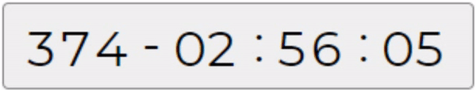

```js
/*
 *                                                                                       
 *     _ _____                     _ _     _ _   _____             _ _             _     
 *    |_|     |_ _ ___ ___ _ _   _| |_|___|_| |_|   __|___ ___ ___| | |___ ___    |_|___
 *    | |  |  | | | -_|  _| | |_| . | | . | |  _|__   |  _|  _| . | | | -_|  _|_  | |_ -|
 *   _| |__  _|___|___|_| |_  |_|___|_|_  |_|_| |_____|___|_| |___|_|_|___|_| |_|_| |___|
 *  |___|  |__|           |___|       |___|                                     |___|    
 *                                                                          Version 1.0.0
 *  
 *                                                  Stefanos Vichas <stefanos@vichas.org>
 *  
 */
```




A jquery plugin for digit scrolling.

---

### Installation

This Plugin requires jQuery.

```html
<link rel="stylesheet" href="../dist/jquery.digitScroller.css">
<script src="../dist/jquery.digitScroller.js"></script>
```

### Example
```html
<script>
  $(function() {

    var scroller = $(".digit_scroll_container").digitScroller({
      scrollDuration: 500, // duration between number change
    })

    // Method to set scroll duration
    scroller.scrollDuration(200);

    // Method to scroll to a number one by one.
    scroller.scrollTo(99);

    // Method to jump directly to a number
    scroller.jumpTo(99);

  });
</script>

<div class="digit_scroll_container">00</div>
```
